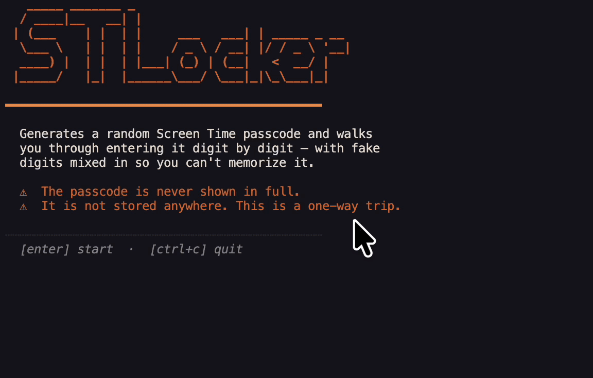

# Screentime-locker

Sets a macOS Screen Time passcode **you can't remember**.



Generates a random 4-digit code, then walks you through typing it into System Settings one digit at a time, with fake digits and deletions mixed in so you never see the full passcode. Two rounds (enter + confirm), then it's gone from memory. Nothing is stored or logged.

## Run

```bash
brew install go
go run .
```

Open **System Settings → Screen Time → Lock Screen Time Settings** before starting.

## Reset

Change with iCloud Screen Time reset.


